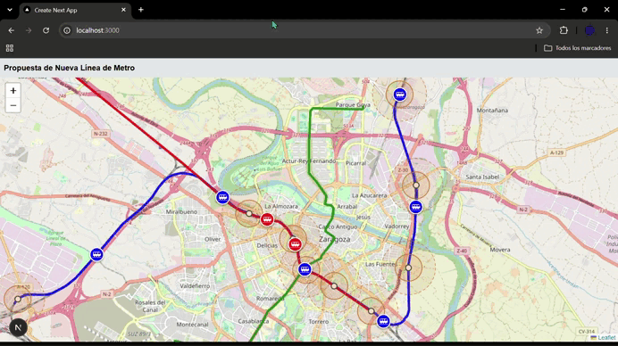

Simulación Propuesta Mobility Summit 2026: 
Mejora de la movilidad mediante la adecuación de la infraestructura ferroviaria existente, que cruza Zaragoza, para la creación de una línea de metro. Consolidando un eje de transporte público de alta capacidad complementario al tranvía.

